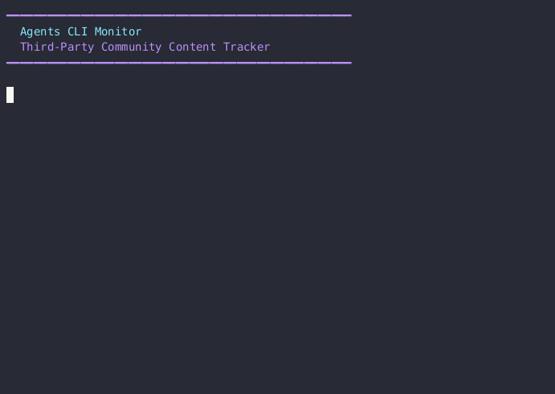

# agents-cli-monitor

An automated monitoring agent that discovers and tracks third-party community content about [Google Agents CLI](https://github.com/google/agents-cli).

Built with [`agents-cli`](https://github.com/google/agents-cli) on top of [Google ADK](https://google.github.io/adk-docs/). Runs comprehensive web searches, validates relevance, and maintains a curated list of community mentions. Deploys to Cloud Run and runs daily sweeps via Cloud Scheduler.



## What it tracks

The agent tracks **both third-party and first-party content** in separate files:

### Third-Party Community Content (`data/agents_cli_mentions.md`)
- ✅ Medium articles, blog posts, newsletters (Medium, Substack, Dev.to)
- ✅ Technical publications (InfoQ, Habr, TowardsAI)
- ✅ YouTube community tutorials and demos
- ✅ Reddit discussions (r/AIforDevs, r/googlecloud)
- ✅ International platforms (Zenn, Speaker Deck, Qiita)
- ✅ Social media posts (Twitter, LinkedIn)

### First-Party Google Content (`data/agents_cli_mentions_first_party.md`)
- ✅ developers.googleblog.com (Google Developer Blog)
- ✅ docs.cloud.google.com (Google Cloud Docs)
- ✅ adk.dev (ADK documentation)

**Excluded even from first-party:**
- ❌ google.github.io/agents-cli (official docs site itself)
- ❌ github.com/google/agents-cli (the repo itself)

This separation helps measure **community adoption** (third-party) separately from **official documentation** (first-party).

## How it works

```
┌─────────────────┐     ┌─────────────────┐     ┌─────────────────┐
│ Cloud Scheduler │────>│ agents-cli-     │────>│ Google Cloud    │
│ (daily trigger) │     │ monitor         │     │ Storage         │
└─────────────────┘     │ (Cloud Run)     │     │ (tracking file) │
                        └────────▲────────┘     └─────────────────┘
                                 │
                        ┌────────┴────────┐
                        │ Google Search   │
                        │ Grounding API   │
                        └─────────────────┘
```

The agent runs a batch of 41 optimized search queries targeting third-party platforms (Medium, InfoQ, YouTube, Reddit, etc.). Each URL is validated using pattern detection with three-tier confidence scoring. First-party Google content is filtered out. Results are deduplicated using MD5 hashing and saved to a markdown file in Google Cloud Storage.

## Performance

```
Third-Party URLs Tracked: 24
Recall on Third-Party:    42.9% (3/7 eval URLs)
New URLs Discovered:      20+
Precision:                100% (zero false positives)
```

**11 platforms discovered:** Medium, InfoQ, Habr, Dev.to, Reddit, YouTube, Daily.dev, Substack, TowardsAI, Zenn (Japan), Speaker Deck

## Get started

You'll need [uv](https://docs.astral.sh/uv/), the [Google Cloud SDK](https://cloud.google.com/sdk/docs/install), and a GCP project with Vertex AI enabled.

Everything else goes through [`agents-cli`](https://github.com/google/agents-cli):

```bash
# Install the CLI (one time)
uv tool install google-agents-cli

# Install project dependencies
agents-cli install

# Configure your environment
cp .env.example .env
# Edit .env and set GOOGLE_CLOUD_PROJECT, TRACKING_FILE_PATH

# Run monitoring sweep locally
# Option 1: Third-party content only
uv run python run_monitoring_sweep.py

# Option 2: Both third-party AND first-party content
uv run python run_full_monitoring_sweep.py

# View results
cat data/agents_cli_mentions.md                    # Third-party content
cat data/agents_cli_mentions_first_party.md        # First-party content

# Or use the helper script
uv run python scripts/view_results.py data/agents_cli_mentions.md
```

## Configure your environment

Copy `.env.example` to `.env` and fill in the values:

| Variable | Description |
|----------|-------------|
| `GOOGLE_CLOUD_PROJECT` | Your Google Cloud project ID |
| `GOOGLE_CLOUD_LOCATION` | Region for Gemini API (us-central1) |
| `GOOGLE_GENAI_USE_VERTEXAI` | Use Vertex AI (True) |
| `TRACKING_FILE_PATH` | Where to store results. Local: `data/agents_cli_mentions.md` or GCS: `gs://bucket-name/agents_cli_mentions.md` |

For GCS storage (recommended for production):

```bash
# Create a GCS bucket
export PROJECT_ID=your-project-id
gsutil mb -p ${PROJECT_ID} -l us-central1 gs://agents-cli-monitor-${PROJECT_ID}

# Update .env
TRACKING_FILE_PATH=gs://agents-cli-monitor-${PROJECT_ID}/agents_cli_mentions.md
```

## How the monitoring works

1. **Batch Search** - Runs 41 queries targeting third-party platforms (Medium, InfoQ, YouTube, Reddit, etc.)
2. **Pattern Detection** - Validates that content explicitly mentions "agents-cli" with three-tier confidence scoring
3. **First-Party Filter** - Excludes all Google-owned domains (google.github.io, docs.cloud.google.com, adk.dev, etc.)
4. **Title Extraction** - Parses actual page titles from Gemini's formatted responses
5. **Deduplication** - MD5-based URL tracking prevents duplicates
6. **Save to GCS/Local** - Stores results chronologically in markdown format

## Utility scripts

The `scripts/` directory contains helpful utilities:

```bash
# Run a test monitoring sweep with detailed output
uv run python scripts/test_sweep.py

# View tracking file contents (local or GCS)
uv run python scripts/view_results.py data/agents_cli_mentions.md
uv run python scripts/view_results.py gs://bucket/agents_cli_mentions.md --limit 10

# Manually trigger deployed Cloud Run service
./scripts/trigger_sweep.sh
```

## Sample discoveries

- "How to Build and Deploy AI Agents on Google Cloud" (TowardsAI)
- "Google agents-cli: AI Builds & Deploys Enterprise Agents" (Substack)
- "Building AI Agents with Google ADK and Agents CLI" (Medium)
- "Google Agents CLI: Full Beginner Guide" (Dev.to)
- Community tutorials and demos on YouTube
- Technical discussions on Reddit (r/AIforDevs, r/googlecloud)
- Japanese technical articles on Zenn
- Conference presentations on Speaker Deck

## Deploy to production

The project is configured for Cloud Run deployment with daily scheduled runs.

```bash
# 1. Enable required APIs
gcloud services enable run.googleapis.com cloudscheduler.googleapis.com

# 2. Create GCS bucket for tracking file
export PROJECT_ID=your-project-id
gsutil mb -p ${PROJECT_ID} -l us-central1 gs://agents-cli-monitor-${PROJECT_ID}

# 3. Update .deploy.yaml with your bucket path
#    Set TRACKING_FILE_PATH: gs://agents-cli-monitor-${PROJECT_ID}/agents_cli_mentions.md

# 4. Deploy to Cloud Run
agents-cli deploy
```

This will:
- Build and deploy the agent to Cloud Run (us-central1)
- Create a Cloud Scheduler job that runs daily at 9:07 AM Pacific
- Set up environment variables from `.deploy.yaml`
- Configure the service with 512Mi memory and 540s timeout

### Manual trigger

Trigger a sweep manually:

```bash
./scripts/trigger_sweep.sh

# Or via Cloud Scheduler
gcloud scheduler jobs run agents-cli-monitor-scheduler --location=us-central1
```

### View logs

```bash
gcloud run services logs read agents-cli-monitor --region=us-central1 --limit=50
```

See [`deployment/README.md`](deployment/README.md) for detailed deployment guide.

## Project structure

```
agents-cli-monitor/
├── app/
│   ├── agent.py              # ADK agent definition and system prompt
│   └── tools/
│       ├── batch_search.py   # 41 optimized search queries
│       ├── search_grounding.py # Google Search Grounding API integration
│       ├── search.py         # Pattern detection and validation
│       └── tracking.py       # Read/write tracking file with deduplication
├── scripts/
│   ├── test_sweep.py         # Test monitoring sweep locally
│   ├── view_results.py       # View and analyze tracking file
│   └── trigger_sweep.sh      # Manually trigger Cloud Run deployment
├── deployment/
│   └── README.md             # Detailed deployment guide
├── tests/                    # Unit and integration tests
├── run_monitoring_sweep.py   # Main monitoring sweep script
├── .deploy.yaml              # Cloud Run deployment configuration
├── .env.example              # Environment variable template
├── GEMINI.md                 # Agent development guidance
└── README.md                 # This file
```

## Requirements

- Python 3.11-3.13
- [uv](https://docs.astral.sh/uv/) (package manager)
- [Google Cloud SDK](https://cloud.google.com/sdk/docs/install)
- Google Cloud project with Vertex AI enabled
- Google ADK 1.15.0+ (installed via agents-cli)

The agent uses:
- **Model**: Gemini 2.5 Flash (gemini-2.5-flash)
- **Region**: us-central1
- **API**: Google Search Grounding for web search

## Why third-party only?

We want to measure **community adoption**, not Google's promotion of its own tools. First-party content (official docs, blogs, repositories) is already well known. The interesting signal is whether external developers, bloggers, and creators are discovering, using, and writing about Agents CLI organically.

This helps us understand:
- Which third-party platforms are featuring Agents CLI
- What types of content the community is creating (tutorials, reviews, comparisons)
- International adoption across different languages and regions
- Community sentiment and real-world use cases

## Contributing

This project is open source. Contributions welcome! Please ensure:
- No hardcoded project IDs or secrets
- Follow ADK and agents-cli best practices
- Test locally before submitting PRs
- Don't overfit to evaluation data

## License

Apache 2.0 - see LICENSE file for details.
